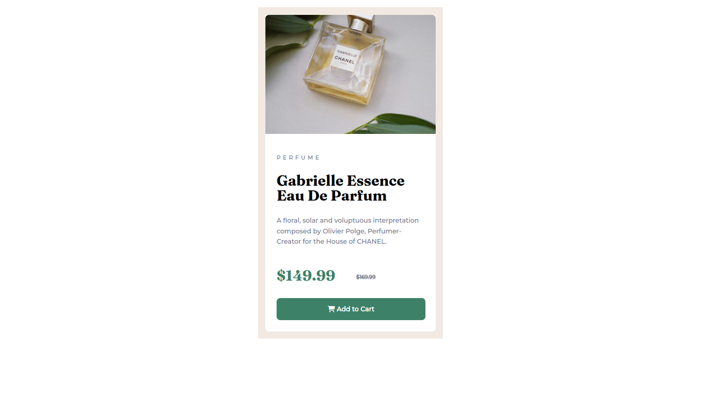
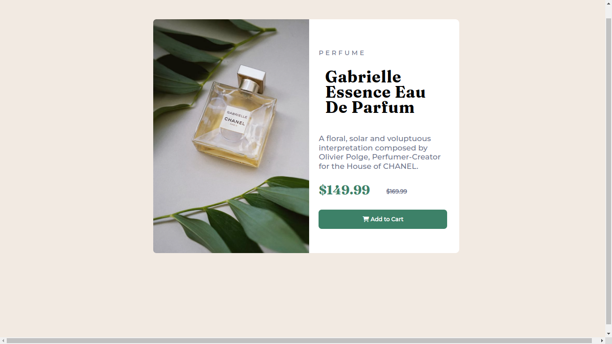

# Frontend Mentor - Product preview card component solution

This is a solution to the [Product preview card component challenge on Frontend Mentor](https://www.frontendmentor.io/challenges/product-preview-card-component-GO7UmttRfa). Frontend Mentor challenges help you improve your coding skills by building realistic projects. 

## Table of contents
  - [Overview](#overview)
  - [The challenge](#the-challenge)
  - [Screenshot](#screenshot)
  - [Links](#links)
  - [My process](#my-process)
  - [Built with](#built-with)
  - [What I learned](#what-i-learned)
  - [Continued development](#continued-development)
  - [Useful resources](#useful-resources)
  - [Author](#author)
  - [Acknowledgments](#acknowledgments)


### Screenshot




### Links

- [Github link](https://github.com/Have-Samuel/product-preview-card-component)
- [Live Demo](https://silly-card-infinite.netlify.app/)

## My process

### Built with

- Semantic HTML5 markup
- CSS custom properties
- Flexbox
- Mobile-first workflow

### What I learned

```html
<span>A floral, solar and voluptuous interpretation composed by Olivier Polge, Perfumer-Creator for the House of CHANEL.</span>
```
```css
@media (min-width: 1000px) {

}
```

### Continued development
```
Responsiveness

```
```
Media Queries

```

### Useful resources

- [W3schools](https://www.w3schools.com/) - This helped me for responsivess and media queries.
- [Figma](https://www.figma.com/) - Figma is an amazing, it helped me finally understand the whole design frame. I'd recommend it to anyone still learning this concept. I really liked this pattern and will use it going forward.

## Author

- [Github](https://github.com/Have-Samuel)
- [@Have-Samuel](https://www.frontendmentor.io/profile/Have-Samuel)
- [@samhave1](https://twitter.com/samhave1)

## 🤝 Contributing

Contributions, issues, and feature requests are welcome!

Feel free to check the [issues page](https://github.com/Have-Samuel/product-preview-card-component/issues).

## Show your support

Give a ⭐️ if you like this project!

## Acknowledgments

- Thanks to Frontend Mentor
- etc

## 📝 License

This project is [MIT](./MIT.md) licensed.